# End-to-End Guide: Simple Calculator Demo 🚀

## Overview

This guide provides a complete visual walkthrough of the entire development lifecycle - from writing code to deploying test reports - using Mermaid diagrams.

---

## Table of Contents

- [Complete System Overview](#complete-system-overview)
- [Developer Workflow](#developer-workflow)
- [Pre-commit Hook Flow](#pre-commit-hook-flow)
- [CI/CD Pipeline Flow](#cicd-pipeline-flow)
- [Test Execution & Reporting](#test-execution--reporting)
- [Data Flow Architecture](#data-flow-architecture)
- [Deployment Process](#deployment-process)

---

## Complete System Overview

This diagram shows how all the pieces fit together:

```mermaid
graph TB
    subgraph Developer["👨‍💻 Developer Environment"]
        Code[Write Code]
        LocalTest[Run Tests Locally]
        PreCommit[Pre-commit Hooks]
    end

    subgraph VCS["📦 Version Control"]
        Git[Git Repository]
        GitHub[GitHub Remote]
    end

    subgraph CI["🤖 GitHub Actions CI/CD"]
        Lint[Lint Job]
        Security[Security Job]
        Test[Test Job]
        Report[Report Generation]
        Deploy[Deploy Job]
    end

    subgraph Artifacts["📊 Outputs"]
        AllureReport[Allure Report]
        Pages[GitHub Pages]
        PublicURL[Public URL]
    end

    Code --> LocalTest
    LocalTest --> PreCommit
    PreCommit --> Git
    Git --> GitHub

    GitHub --> Lint
    GitHub --> Security
    Lint --> Test
    Security --> Test
    Test --> Report
    Report --> AllureReport
    AllureReport --> Deploy
    Deploy --> Pages
    Pages --> PublicURL

    style Developer fill:#e1f5ff
    style CI fill:#fff3cd
    style Artifacts fill:#d4edda
```



---

## Developer Workflow

The daily development cycle from code changes to commit:

```mermaid
flowchart TD
    Start([Start Development]) --> Edit[Edit calculator.py]

    Edit --> RunCalc{Want to test<br/>manually?}
    RunCalc -->|Yes| Manual[python -m calculator.calculator]
    RunCalc -->|No| RunTests
    Manual --> RunTests

    RunTests[pytest --alluredir=allure-results]
    RunTests --> TestPass{Tests Pass?}

    TestPass -->|No| FixCode[Fix Code]
    FixCode --> Edit

    TestPass -->|Yes| ViewReport[View reports/test-report.html]
    ViewReport --> Satisfied{Satisfied with<br/>changes?}

    Satisfied -->|No| Edit
    Satisfied -->|Yes| GitAdd[git add .]

    GitAdd --> GitCommit[git commit -m "message"]
    GitCommit --> PreCommitTrigger[⚡ Pre-commit hooks trigger]

    PreCommitTrigger --> HookChecks{All hooks<br/>pass?}

    HookChecks -->|No| ShowErrors[Show errors]
    ShowErrors --> FixIssues[Fix issues]
    FixIssues --> GitAdd

    HookChecks -->|Yes| CommitSuccess[✅ Commit successful]
    CommitSuccess --> Push[git push origin main]

    Push --> CITrigger[🚀 GitHub Actions triggered]
    CITrigger --> End([Wait for CI results])

    style Start fill:#e1f5ff
    style CommitSuccess fill:#d4edda
    style End fill:#d4edda
    style PreCommitTrigger fill:#fff3cd
    style CITrigger fill:#fff3cd
```

---

## Pre-commit Hook Flow

What happens when you try to commit code:


---

## CI/CD Pipeline Flow

The complete GitHub Actions workflow:

```mermaid
flowchart TD
    Trigger([Push to main or PR]) --> Parallel{Parallel Stage}

    subgraph Stage1["Stage 1: Quality Gates (Parallel)"]
        Lint[🔍 Lint Job<br/>- Ruff linting<br/>- Code quality checks]
        Security[🔒 Security Job<br/>- CodeQL analysis<br/>- Bandit security scan]
    end

    Parallel --> Lint
    Parallel --> Security

    Lint --> WaitGate{Both complete?}
    Security --> WaitGate

    WaitGate --> Test

    subgraph Stage2["Stage 2: Testing (Sequential)"]
        Test[🧪 Test Job<br/>- Run pytest<br/>- Generate allure-results/]

        Test --> Cache1{Check cache}
        Cache1 -->|Hit| FastTest[⚡ Use cached dependencies<br/>~15s]
        Cache1 -->|Miss| SlowTest[📦 Install dependencies<br/>~45s]

        FastTest --> TestComplete
        SlowTest --> TestComplete
        TestComplete[Tests complete]
    end

    TestComplete --> Report

    subgraph Stage3["Stage 3: Reporting (Sequential)"]
        Report[📊 Report Job<br/>- Fetch history from gh-pages<br/>- Merge with new results<br/>- Generate Allure report]

        Report --> UploadArtifact[⬆️ Upload artifact<br/>allure-history.zip]
    end

    UploadArtifact --> DeployCheck{Branch is main?}

    DeployCheck -->|Yes| Deploy
    DeployCheck -->|No| SkipDeploy[⏭️ Skip deployment<br/>View in artifacts]

    subgraph Stage4["Stage 4: Deployment (Conditional)"]
        Deploy[🚀 Deploy Job<br/>- Download report artifact<br/>- Deploy to GitHub Pages]

        Deploy --> Published[✅ Published to gh-pages]
        Published --> LiveURL[🔗 Live at GitHub Pages URL]
    end

    SkipDeploy --> End([End])
    LiveURL --> End

    style Stage1 fill:#fff3cd
    style Stage2 fill:#e1f5ff
    style Stage3 fill:#d4edda
    style Stage4 fill:#f8d7da
    style End fill:#d4edda
```



---

## Test Execution & Reporting

How tests are executed and reports generated:


---

## Data Flow Architecture

How data moves through the system:

```mermaid
graph LR
    subgraph Source["📝 Source Code"]
        CalcPy[calculator.py<br/>~100 lines]
        TestPy[test_calculator.py<br/>5 test cases]
    end

    subgraph Execution["⚙️ Test Execution"]
        Pytest[pytest framework]
        Fixtures[Test fixtures]
        Assertions[assert statements]
    end

    subgraph RawData["📁 Raw Data"]
        AllureResults[allure-results/<br/>JSON test data]
        JUnit[junit.xml<br/>CI/CD format]
        HTML[test-report.html<br/>Quick view]
    end

    subgraph Processing["🔄 Processing"]
        FetchHistory[Fetch gh-pages<br/>last 20 runs]
        MergeData[Merge with<br/>new results]
        GenerateReport[Generate<br/>Allure HTML]
    end

    subgraph Output["📊 Final Output"]
        AllureHTML[Allure Report<br/>Interactive HTML]
        Trends[Trend Charts]
        History[Historical Data]
    end

    subgraph Delivery["🚀 Delivery"]
        Artifact[GitHub Artifact<br/>Download zip]
        Pages[GitHub Pages<br/>Live website]
        URL[Public URL]
    end

    CalcPy --> Pytest
    TestPy --> Pytest
    Pytest --> Fixtures
    Fixtures --> Assertions

    Assertions --> AllureResults
    Assertions --> JUnit
    Assertions --> HTML

    AllureResults --> FetchHistory
    FetchHistory --> MergeData
    MergeData --> GenerateReport

    GenerateReport --> AllureHTML
    GenerateReport --> Trends
    GenerateReport --> History

    AllureHTML --> Artifact
    AllureHTML --> Pages
    Pages --> URL

    style Source fill:#e1f5ff
    style Execution fill:#fff3cd
    style RawData fill:#ffe5cc
    style Processing fill:#e5ccff
    style Output fill:#d4edda
    style Delivery fill:#f8d7da
```



---

## Deployment Process

Detailed view of the GitHub Pages deployment:


---

## Complete User Journey

From code change to viewing results online:


---

## Technology Stack Flow

How different technologies interact:

```mermaid
graph TB
    subgraph Dev["Developer Tools"]
        Python[Python 3.9+]
        Git[Git VCS]
        Editor[Code Editor]
    end

    subgraph Testing["Testing Stack"]
        Pytest[pytest framework]
        AllurePlugin[allure-pytest plugin]
        PytestHTML[pytest-html plugin]
        Coverage[pytest-cov]
    end

    subgraph Quality["Quality Tools"]
        Ruff[Ruff linter/formatter]
        Gitleaks[Gitleaks secret scanner]
        PreCommitFW[pre-commit framework]
    end

    subgraph CI["CI/CD Platform"]
        Actions[GitHub Actions]
        Runners[Ubuntu Runners]
        Cache[GitHub Cache]
    end

    subgraph Security["Security Scanning"]
        CodeQL[CodeQL Analysis]
        Bandit[Bandit Scanner]
    end

    subgraph Reporting["Reporting Tools"]
        AllureGen[Allure Report Generator]
        AllureAction[allure-report-action]
    end

    subgraph Hosting["Hosting Infrastructure"]
        GHPages[GitHub Pages]
        DNS[Custom Domain Support]
    end

    subgraph Package["Package Management"]
        Pip[pip]
        UV[uv (10-100x faster)]
        PyprojectToml[pyproject.toml]
    end

    Python --> Pytest
    Pytest --> AllurePlugin
    Pytest --> PytestHTML
    Pytest --> Coverage

    Editor --> Git
    Git --> PreCommitFW
    PreCommitFW --> Ruff
    PreCommitFW --> Gitleaks

    Git --> Actions
    Actions --> Runners
    Runners --> Cache

    Actions --> CodeQL
    Actions --> Bandit

    AllurePlugin --> AllureGen
    AllureGen --> AllureAction
    AllureAction --> GHPages
    GHPages --> DNS

    PyprojectToml --> Pip
    PyprojectToml --> UV

    style Dev fill:#e1f5ff
    style Testing fill:#d4edda
    style Quality fill:#fff3cd
    style CI fill:#f8d7da
    style Security fill:#ffe5cc
    style Reporting fill:#e5ccff
    style Hosting fill:#ccf5e5
    style Package fill:#f5e5cc
```

---

## Caching Strategy

How multi-layer caching speeds up the pipeline:

```mermaid
flowchart TD
    Start([CI Job Starts]) --> Layer1{Layer 1:<br/>Pip Cache}

    Layer1 -->|Cache Hit| L1Hit[⚡ Restore pip packages<br/>Save ~20s]
    Layer1 -->|Cache Miss| L1Miss[📦 Download packages<br/>Takes ~20s]

    L1Hit --> Layer2{Layer 2:<br/>Package Cache}
    L1Miss --> CacheSave1[Save to pip cache]
    CacheSave1 --> Layer2

    Layer2 -->|Cache Hit| L2Hit[⚡ Restore ~/.cache/pip<br/>Save ~10s]
    Layer2 -->|Cache Miss| L2Miss[📦 Build packages<br/>Takes ~10s]

    L2Hit --> Layer3{Layer 3:<br/>pytest Cache}
    L2Miss --> CacheSave2[Save to package cache]
    CacheSave2 --> Layer3

    Layer3 -->|Cache Hit| L3Hit[⚡ Restore .pytest_cache<br/>Save ~5s]
    Layer3 -->|Cache Miss| L3Miss[🔄 Collect tests<br/>Takes ~5s]

    L3Hit --> RunTests[Run Tests]
    L3Miss --> CacheSave3[Save to pytest cache]
    CacheSave3 --> RunTests

    RunTests --> Result{Total Time}
    Result -->|All Cache Hits| Fast[⚡ ~15 seconds<br/>3x faster!]
    Result -->|No Cache| Slow[📦 ~45 seconds<br/>First run]

    Fast --> End([Tests Complete])
    Slow --> End

    style Layer1 fill:#e1f5ff
    style Layer2 fill:#fff3cd
    style Layer3 fill:#d4edda
    style Fast fill:#d4edda
    style Slow fill:#f8d7da
```



**Cache Invalidation**:
- **Pip cache**: Invalidates when `requirements.txt` changes
- **Package cache**: Invalidates when dependencies change
- **pytest cache**: Invalidates when test files change

---

## Error Handling Flow

What happens when things go wrong:

```mermaid
flowchart TD
    Start([Developer pushes code]) --> PreCommit{Pre-commit<br/>checks}

    PreCommit -->|❌ Fail| PC_Error[Show error message]
    PC_Error --> PC_Fix[Developer fixes locally]
    PC_Fix --> Start

    PreCommit -->|✅ Pass| Pushed[Code pushed to GitHub]
    Pushed --> Lint{Lint job}

    Lint -->|❌ Fail| L_Error[❌ Workflow fails<br/>Red X on PR]
    L_Error --> L_Fix[Fix linting issues]
    L_Fix --> Start

    Lint -->|✅ Pass| SecScan{Security scan}

    SecScan -->|❌ Fail| S_Error[❌ Vulnerability found<br/>Block merge]
    S_Error --> S_Fix[Fix security issue]
    S_Fix --> Start

    SecScan -->|✅ Pass| Tests{Run tests}

    Tests -->|❌ Fail| T_Error[❌ Test failed<br/>Show failure details]
    T_Error --> T_Fix[Fix failing test]
    T_Fix --> Start

    Tests -->|✅ Pass| Report[Generate report]
    Report --> Deploy{Deploy to<br/>GitHub Pages}

    Deploy -->|❌ Fail| D_Error[❌ Deployment failed<br/>Check permissions]
    D_Error --> D_Fix[Fix deployment config]
    D_Fix --> Report

    Deploy -->|✅ Pass| Success[✅ Complete success<br/>Report live!]
    Success --> End([End])

    style PC_Error fill:#f8d7da
    style L_Error fill:#f8d7da
    style S_Error fill:#f8d7da
    style T_Error fill:#f8d7da
    style D_Error fill:#f8d7da
    style Success fill:#d4edda
```



---

## State Diagram: Test Report Status

The lifecycle of a test report:


---

## Calculator Logic Flow

For completeness, how the calculator itself works:


---

## Summary: The Complete Picture


---

## Quick Reference

### Key URLs
- **Live Reports**: `https://username.github.io/simple-calculator-demo/`
- **Repository**: GitHub repo URL
- **Workflow Runs**: GitHub Actions tab

### Key Commands
```bash
# Local development
pytest                                    # Quick test
pytest --alluredir=allure-results        # Generate Allure data
allure serve allure-results              # View Allure report

# Pre-commit
pre-commit install                       # One-time setup
pre-commit run --all-files              # Manual run

# Package management
pip install -r requirements.txt         # Traditional
uv pip install -e ".[dev]"             # Modern & fast
```

### Key Files
- `calculator/calculator.py` - Main code
- `tests/test_calculator.py` - Test cases
- `.github/workflows/tests.yml` - CI/CD pipeline
- `.pre-commit-config.yaml` - Pre-commit hooks
- `pyproject.toml` - Project configuration

---

## Learning Path

1. **Start here**: Understand the [Complete System Overview](#complete-system-overview)
2. **Follow the flow**: Trace through [Developer Workflow](#developer-workflow)
3. **See automation**: Check [Pre-commit Hook Flow](#pre-commit-hook-flow)
4. **Understand CI/CD**: Study [CI/CD Pipeline Flow](#cicd-pipeline-flow)
5. **Deep dive**: Explore [Data Flow Architecture](#data-flow-architecture)

---

## Next Steps

- See `guides/README.md` for step-by-step tutorials
- Read `docs/ARCHITECTURE.md` for detailed technical info
- Check `docs/CI-CD.md` for CI/CD insights
- View `docs/ALLURE.md` for reporting details

---

**Remember**: Simple outside (basic calculator), sophisticated inside (enterprise infrastructure)! 🎯
